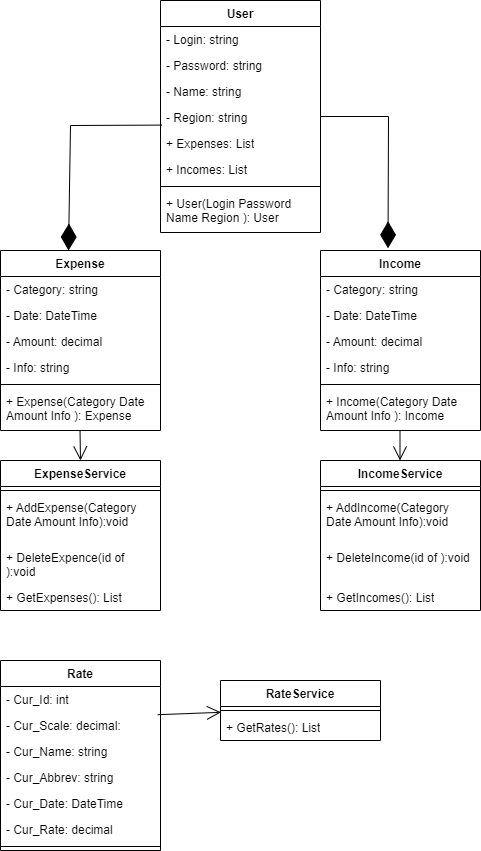

# oop

## Евдоковец Андрей 253505

  ## Проект: Expense/income tracker (средство для контроля трат и доходов пользователя)
User создает аккаунт(имя, регион, валюта и пр.), имеет возможность отслеживать расходы:
класс Expanse обладает такими атрибутами как 

Category(на дом/транспорт/обучение/развлечение), 
Amount(сумма), 
Date(дата), 
Info(заметка к транзакции).

Так же с доходом:
класс Income обладает 
Category(зар. плата, подарок, инвестиции и др.),
Amount(сумма),
Date(дата), 
Info(заметка к транзакции).

Для работы с данными классами имеются классы-трекеры: ExpanseTracker, IncomeTracker. Каждый из которых хранит в себе список для хранения своих транзакций
а также реализует методы для добавления и удаления доходов/расходов из списка.

Приложение позволяет отслеживать статистику
Также имеется (можно добавить) конвертер валют, по курсу на выбранную дату перевод из одной валюты в другую (+ просто курс), курс текущий курс будет запрашиваться с
веб-сервисов(например nbrb rest api):
класс Rate 
Cur_ID(внутренний код)
Date(дата, на которую запрашивается курс)
Cur_Abbreviation(буквенный код)
Cur_Scale(количество единиц иностранной валюты)
Cur_Name(наименование валюты на русском языке во множественном, либо в единственном числе, в зависимости от количества единиц)
Cur_OfficialRate(курс)

для структурированно хранения данных - БД
класс dBService реализует методы загрузки и сохранения транзакций и их данных

UI позволяет пользователю взаимодействовать с вышеописанной логикой.

# Диаграмма классов

 
